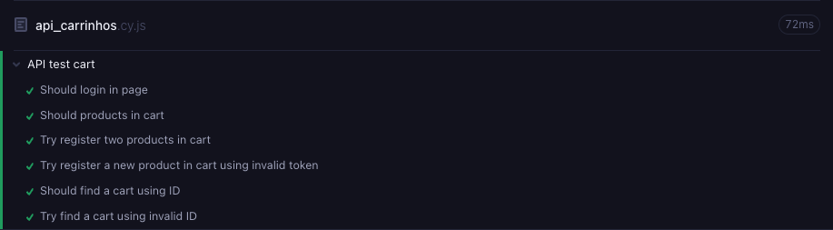
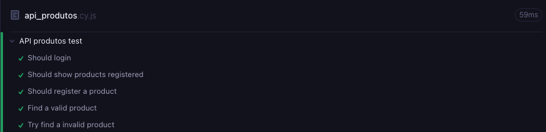
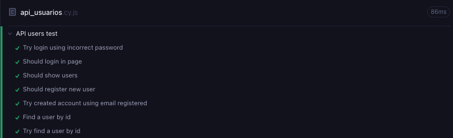

## 🧪 Cypress API Test Project – Serverest
Este projeto utiliza o Cypress para realizar testes automatizados na API do Serverest — uma API simulada voltada para estudos de automação de testes de serviços REST.

## 🚀 Tecnologias Utilizadas
- Cypress – Framework de testes end-to-end

- Node.js – Ambiente de execução JavaScript

- Mocha e Chai – Frameworks de testes e asserções (integrados ao Cypress)

- Serverest – API falsa utilizada para fins educacionais

- Faker - Para simular a entrada de inputs

- CI - Projeto integrado ao GitHub actions

## 🛠️  Instalação e Uso
1. Clone o repositório:
- git clone https://github.com/eliasramiresjr/teste_api_cypress.git

- cd nome-do-repositorio

2. Instale as dependências:
- npm install

3. Execute os testes (interface):
- npx cypress open

4. Rodar os testes em modo headless (terminal):
- npx cypress run

## 📌 Testes Implementados
- Usuários

- Cadastro de usuário

- Validação de campos obrigatórios

- Verificação de usuário administrador

- Login

- Login com sucesso

- Login inválido

- Produtos

- Listagem de produtos

<!-- - Cadastro, edição e exclusão de produto -->

- Carrinho

- Adicionar produto ao carrinho

- Finalizar compra

<!-- - Cancelar compra -->

## 📚 Boas Práticas Adotadas
- Uso de Cypress.Commands para reutilizar ações comuns (ex: login)

- Separação lógica de testes por recurso (usuarios, login, etc.)

- Validações robustas com expect e should

- Estrutura modular e clara para fácil manutenção